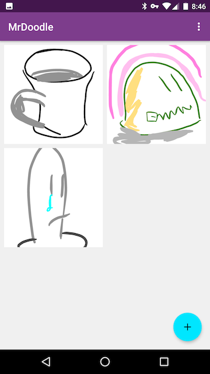
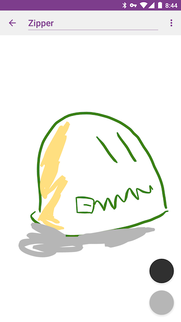
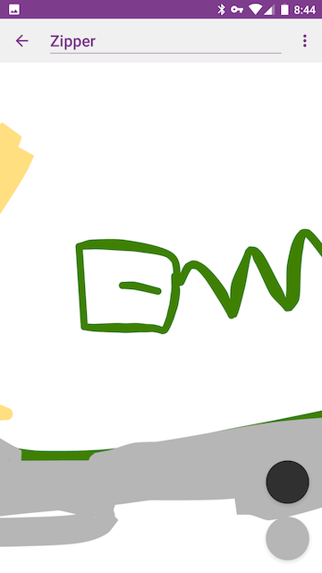

# MrDoodle
A toy drawing app, with sync.

---

In an effort to get more experience with Android developent and Java server-side programming I'm writing MrDoodle. It's nothing fancy, in fact, it's not even *competitive*. If you want an app that lets you draw doodles and keeps them synced across devices, just use Google's Keep.

**But I want to learn and make something fun.**

##Drawing

MrDoodle implements a simple drawing functionality. It smooths input strokes and attempts to create a fairly friendly, realistic stroke style. Since the drawings are vector based, the canvas can be panned and zoomed via two-finger gestures. Nothing fancy, but it works.





I use my [FlyoutMenu](https://github.com/ShamylZakariya/FlyoutMenus) library for pen/eraser and color popups in the drawing UI.

##Sync
So I decided to write a sync engine. "Can't be that hard, right?". Well, we'll see. Sync is not done, but in progress. The sync system features (or will feature):

- Offline-first behavior. Changes are journaled when offline and sync is performed when possible. When online, sync is continuous.
- Use of websockets to broadcast events to connected devices
- Redis for data store
- [sparkjava](http://sparkjava.com/) server
- Google ID for user authentication

"What about conflict resolution" you say? Instead of solving the hardest problem in sync, the plan is to lock documents when they're being edited on one device. Other devices get a read-only view until the device with the edit lock releases it. Then other devices can request a lock on that document, and the server will grant it first come, first serve. So, this is *not* a collaborative drawing tool.

***Note**: This is a rewrite of a similar sync engine I wrote in Node for a non-open-source project which features mostly similar functionality aside from Google Authentication. That sync engine works quite well. This java rewrite is meant to generalize the previous sync engine, and to get my feet wet in java server-size programming.*


##Build
MrDoodle's client and server apps both require **Google Sign-In**. Since I don't want to post the keys I use (for obvious reasons) they've been added to the .gitignore. If you want to build the app and server, you'll need to [sign up and get keys for yourself](https://developers.google.com/identity/sign-in/android/start).

**Android:**

- copy `google-services.json` to `android/MrDoodle/app`, and copy the Oath Server Client Id and Oath Android Client Id to the string resources `oauth_server_client_id` and `oauth_android_client_id` respectively.

**Server:**

- make a file `configuration_secret.json` in `server/config`.
- Add the following to that file:
```
{
	"authenticator":{
		"google":{
			"oauth_server_id": "YOUR-OAUTH-SERVER-ID"
		}
	}
}
```
